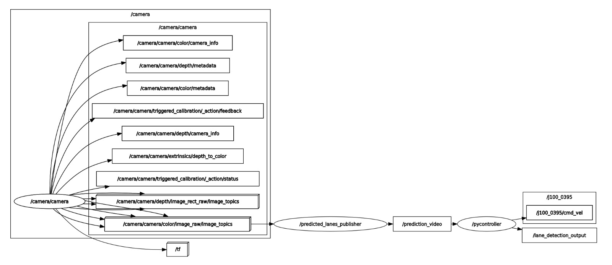

# RealTime-LaneATT Row Detection and Navigation


A Real Time approach to Lane Detection for greenhouse environments based on the paper "Keep your attention on the lane" by Lucas Tabelini, Rodrigo Berriel, Thiago M. Paixao, Claudine Badue, Alberto F. De Souza, Thiago Oliveira-Santos.

---------------

**Table of Contents**

* [Introduction](#introduction)
* [Key Features](#key-features)
* [Model Architecture](#model-architecture)
* [Training and Evaluation](#training-and-evaluation)
* [Metrics](#metrics)
* [Code and Usage](#code-and-usage)
* [Citation](#citation)

**Introduction**
---------------

`Realtime-LaneATT` is a novel line detection model designed specifically for identifying greenhouse line delimitations. Building on previous work in the field, we have developed a real-time lane attention mechanism that enables accurate and efficient detection of line delimitations in greenhouses images and videos.

**Key Features**
----------------

* Real-Time Processing
* New Mechanism for anchor proposals
* Improved Accuracy
* Improved Efficiency
* Reduced training time
* Navigation Capabilities

**Requirements**
----------------

* ROS2 Humble
* Python 3.10+
* OpenCV
* PyTorch 1.12+
* Realsense camera

**Model Architecture**
---------------------

To know more about the model architecture, please refer to our previous work: [RealTime-LaneATT](https://github.com/PaoloReyes/RealTime-LaneATT)

**Code and Usage**
-----------------

* This repository contains the ROS2 packages for the `Realtime-LaneATT` model and its navigation capabilities. The installation method of the model is through the `pip` package manager. To see the source code of the model, please visit our repository: [RealTime-LaneATT](https://github.com/PaoloReyes/RealTime-LaneATT)


**Note:** This package was developed using a Realsense D435 camera, but we are currently working with any camera, so stay tuned for updates.


## Installation

* To install `laneatt` package, run the following command:

```bash
pip install laneatt
```

* Clone the repository to get the ROS2 packages:

```bash
git clone https://github.com/Joel-Milla/LaneAtt_rosws.git
```

## Video Inference and Navigation

To perform a simple real-time inference using the package, build the workspace, source it and run the following command:

```bash
ros2 launch project_startup live_inference.launch.py
```

This will launch a node that will start the video capture from the Realsense camera, and perform an inference of the model. The command would also launch another node in charge of using the inference results to control the node.

If you run the following command in another terminal:

```bash
ros2 run rqt_graph rqt_graph
```

You should see a graph like this:



## Evaluation of the model

To evaluate how the model works in the navigation, you would need an ArUco Marker to set as reference. With preference, use the **4x4** dictionary and the id 43. You can create your own ArUco Marker using the following link: [ArUco Marker Generator](https://chev.me/arucogen/)

Place the marker in the middle of the greenhouse lane, and run the following command:

```bash
ros2 launch project_startup live_inference.launch.py
```

This will start up the inference and navigation nodes. To start the metrics node, run the following command in another terminal:

```bash
ros2 launch metrics start_aruco_launch.py debug:=true realsense:=true
```

This will open an `rqt_image_view` to visualize the camera feed with the detected ArUco marker and the lane lines. Once you have enough data, kill the nodes, and found the metrics saved in the folder `LaneAtt_rosws/install/metrics/share/metrics/logs`. They are saved with a timestamp.

**Citation**
------------

If you find this work useful, please consider citing our paper:

*Soon...*
